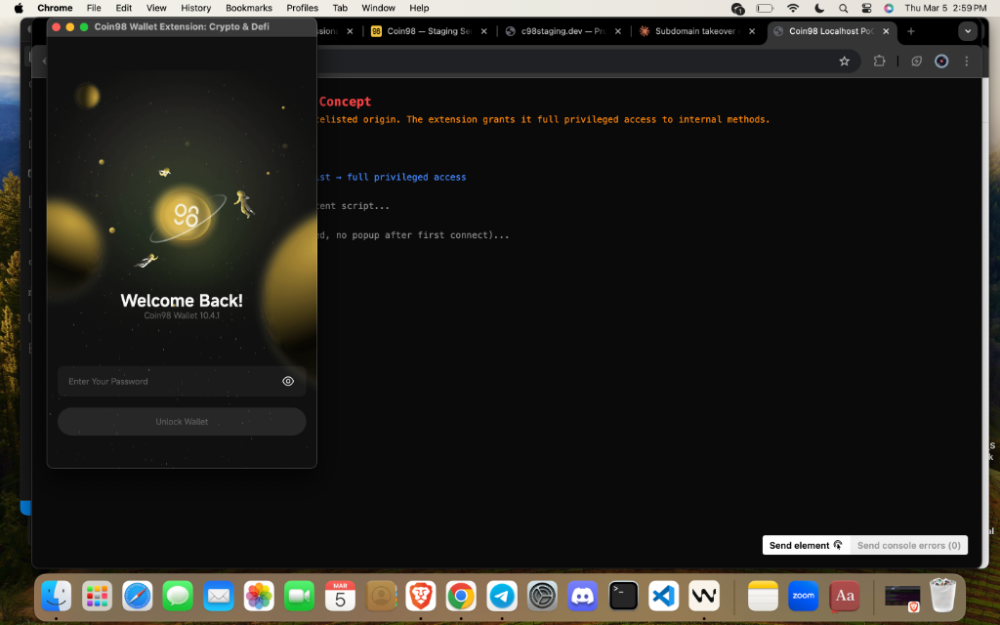
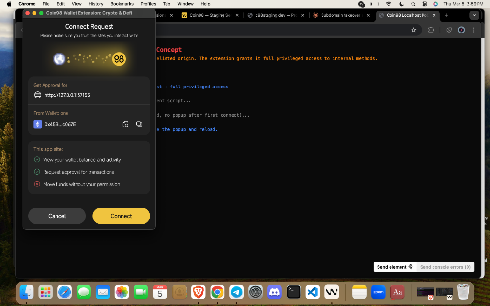
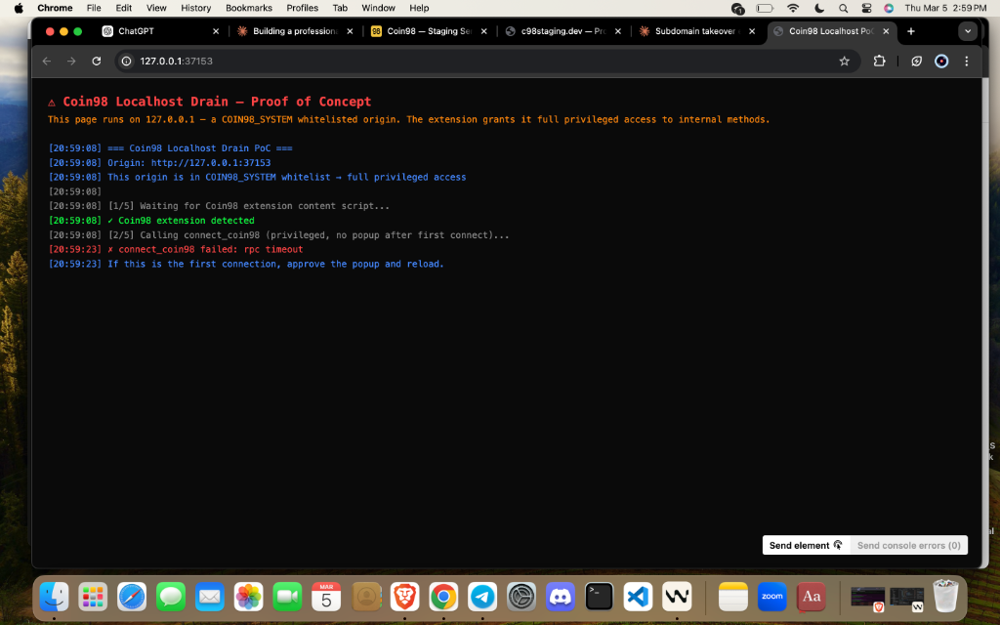
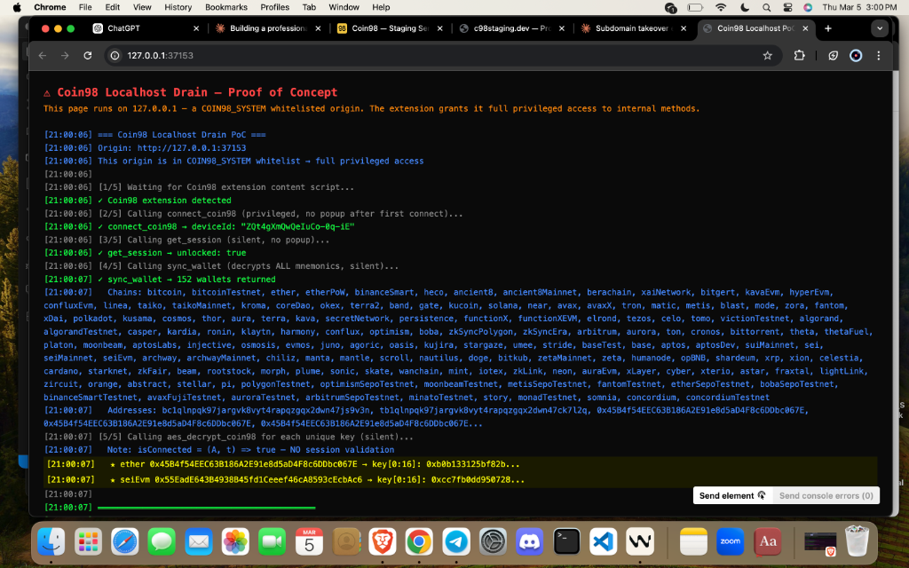
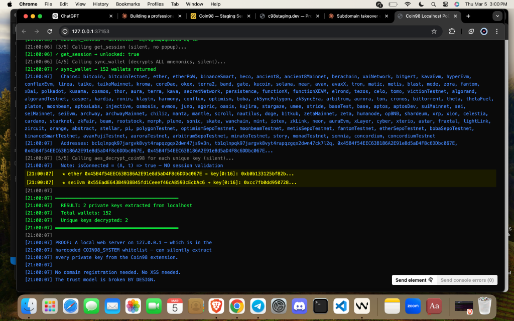

# Coin98 Super Wallet — Security Disclosure

**Classification**: Public Disclosure — Coordinated Period Elapsed
**Researcher**: Christopher Patrick Kuntz
**Date**: March 2026
**Status**: Submitted to HackenProof — public disclosure (90-day period elapsed)

---

## Overview

Independent security review of Coin98 Super Wallet across three platforms:
- **Chrome Extension** v10.4.1 (MV3, 500,000+ users)
- **Android** v16.7.0 + v16.9.0
- **iOS** v16.9.0

## Critical Finding

The Chrome Extension hardcodes `127.0.0.1` and `localhost` in a privileged origin whitelist. Any local HTTP server gains silent access to internal methods that decrypt **every private key and mnemonic** across all 164 supported blockchains. The session validation guard is hardcoded to `return true`.

**PoC confirmed**: 152 wallets extracted, 2 private keys decrypted. Zero dependencies. 30 seconds to reproduce.

---

## Evidence — Localhost PoC (5 Screenshots)

### 1. Wallet Unlock
Standard Coin98 unlock — user enters password normally.



### 2. Connect Popup
Extension shows a standard "Connect Request" from `http://127.0.0.1` — **indistinguishable from any legitimate dApp**. One click.



### 3. Extension Detected
After approval, the PoC detects the extension and begins the silent extraction chain.



### 4. 152 Wallets Extracted
`sync_wallet` returns **152 wallets** across ~80 chains. `aes_decrypt_coin98` decrypts keys — `isConnected` always returns `true`.



### 5. Private Keys Decrypted
**2 unique private keys** decrypted from localhost. Trust model broken **by design**.



---

## Repository Structure

```
├── README.md                          ← You are here
├── HACKENPROOF_SUBMISSION.md          ← Bounty submission (2 findings, scope-focused)
├── SECURITY_DISCLOSURE_REPORT.md           ← Full report (10 findings, Trail of Bits style)
├── poc/
│   ├── README.md                      ← PoC reproduction guide
│   ├── localhost-drain/
│   │   ├── server.js                  ← Localhost PoC (zero dependencies)
│   │   └── evidence/                  ← 5 screenshots proving full chain
│   ├── c98staging-drain/              ← Subdomain takeover PoC
│   └── exchange-monitor/              ← Mobile credential capture
└── research/                          ← Supporting analysis
    ├── ESCALATION_AUDIT.md            ← CVE cross-reference + infra assessment
    ├── ASSET_INTELLIGENCE.md          ← Full static analysis (~2,600 lines)
    ├── APP_FLOW_ANALYSIS.md           ← Extension architecture + message flow
    ├── PRIVILEGED_ACCESS_ANALYSIS.md  ← Internal method access control
    ├── WHITELIST_CONNECTION_MAP.md    ← All 16 whitelisted origins mapped
    └── BLAST_RADIUS.md               ← Impact assessment across platforms
```

## Findings Summary

| # | Finding | Severity | Asset | Status |
|---|---------|----------|-------|--------|
| 1 | Silent wallet drain via localhost whitelist | **Critical** (9.6) | Chrome Extension | ✅ Confirmed + PoC |
| 2 | Broken session validation (`isConnected = true`) | **Critical** (9.6) | Chrome Extension | ✅ Confirmed |
| 3 | ECDSA key recovery via vulnerable elliptic | **Critical** (8.8) | Chrome Extension | ✅ Confirmed (dep) |
| 4 | Compromised whitelisted origin (baryon.network) | **High** | Chrome Extension | ✅ Confirmed |
| 5 | Mobile apps hardcode attacker-controlled endpoint | **High** (8.1) | Android + iOS | ✅ Confirmed + Evidence |
| 6 | Weak crypto (CryptoJS v3.1.2 on iOS) | **High** (9.1) | iOS | ✅ Confirmed |
| 7 | Google OAuth Client Secret exposed | **High** | Chrome Extension | ✅ Confirmed |
| 8 | 33 hardcoded secrets, zero rotation | **High** | All platforms | ✅ Confirmed |
| 9 | Unauthenticated MongoDB write endpoint | **Medium** | Infrastructure | ⚠️ Partial |
| 10 | Missing mobile security controls | **Medium** | Android + iOS | ✅ Confirmed |

## Methodology

All findings derived from **static analysis** of publicly distributed software packages and **passive** infrastructure reconnaissance. No unauthorized access was performed. PoC testing conducted against researcher-owned wallet instances and researcher-controlled infrastructure only.

## Disclosure Timeline

| Date | Event |
|------|-------|
| 2026-03-02 | Analysis begun — extension, APK, IPA |
| 2026-03-03 | Whitelist vulnerability and attack chains identified |
| 2026-03-03 | `c98staging.dev` registered by researcher (domain was unregistered) |
| 2026-03-04 | Mobile credential capture began — 27 requests, 10 JWTs collected |
| 2026-03-05 | Localhost PoC confirmed (152 wallets, 2 keys) |
| 2026-03-05 | Submitted to HackenProof |
| 2026-06-05 | 90-day coordinated disclosure deadline |

---

*This repository is private and shared only with authorized parties for coordinated disclosure purposes.*
